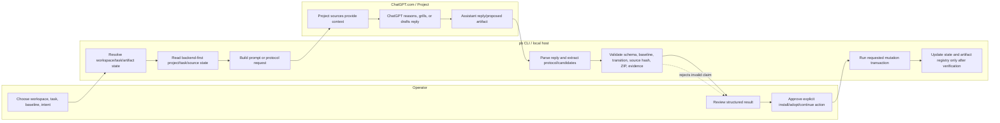
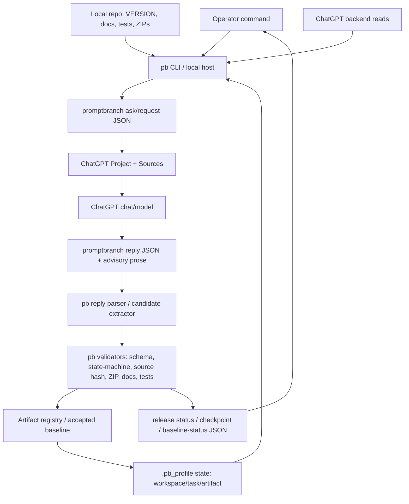
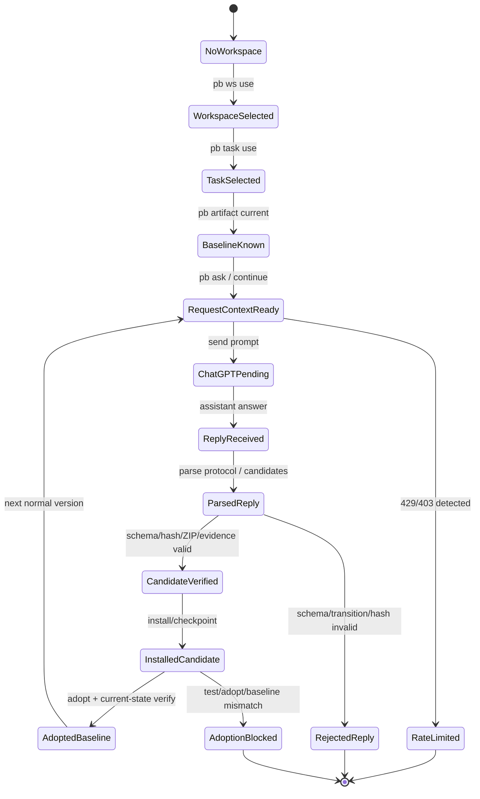

# Promptbranch Application Design — pb and ChatGPT Responsibilities

Release: `v0.1.66`  
Status: documentation site scaffold, editable design-source navigation, and docs-status freshness guard  
Related editable diagrams and overview:

- `docs/design/promptbranch-class-diagram.drawio`
- `docs/design/promptbranch-mvp-living-design.drawio`
- `docs/diagrams/promptbranch-lifecycle/promptbranch_lifecycle_commands.drawio`
- `docs/design/promptbranch-living-design-overview.html`

## Purpose

This document records the application-level design of Promptbranch (`pb`) as a
control-plane shell around ChatGPT Projects. It makes the role split explicit:

```text
pb          = local deterministic control plane, state holder, validator, release gate
ChatGPT     = reasoning/conversation surface and proposal generator
Project     = workspace and source context surface
Local repo  = source of executable tests, docs, release ZIPs, and operator evidence
```

The goal is not to make ChatGPT.com literally become Claude Code. The goal is to
make `pb` provide a reproducible shell workflow around ChatGPT Projects while
respecting ChatGPT's boundaries.

## Authority boundary

| Concern | Owned by `pb` | Owned by ChatGPT |
|---|---|---|
| Workspace/task/artifact state | Stores and verifies current scope state | Provides project/chat context surface |
| Reasoning and grilling | Builds prompt/request envelope and validates reply | Produces analysis, grill output, and draft reply |
| Project Sources | Performs transactional add/list verification | Stores uploaded source context |
| Artifacts | Verifies ZIPs, hygiene, version, registry, adoption | May propose/generated artifact candidate link |
| Release acceptance | Requires test/adopt/current-state evidence | Cannot approve or adopt release by claim |
| Mutations | Triggers only explicit, verified transactions | No local repo/state authority |

Operational rule:

```text
Assistant prose is advisory.
Validated JSON, ZIP checks, tests, and Promptbranch current-state reads are operational.
```

## Release-checkable design invariants

`v0.1.59` makes this design surface part of the read-only release
`docs-status` guard. The guard intentionally checks for these stable phrases so
future documentation edits cannot silently remove the PB/ChatGPT authority split:

```text
Workspace = current ChatGPT Project
Task      = current chat/conversation inside that project
Artifact  = current repo/source bundle/release ZIP
```

The guarded design language must continue to describe:

- backend-first reads
- transactional writes
- accepted baseline / artifact continuity
- activity diagram
- data-flow diagram
- state-transition diagram


## Activity diagram



## Data-flow diagram



## State-transition diagram



## Draw.io source update

This release extends the existing editable draw.io files instead of replacing
them:

| File | New page(s) added |
|---|---|
| `docs/design/promptbranch-class-diagram.drawio` | `PB Application Role Components` |
| `docs/design/promptbranch-mvp-living-design.drawio` | `PB Application Activity — pb and ChatGPT Roles`, `PB Application Data Flow`, `PB Application State Transitions` |
| `docs/diagrams/promptbranch-lifecycle/promptbranch_lifecycle_commands.drawio` | `PB Release State Transitions` |

The Markdown diagrams above are intentionally duplicated as reviewable text so
that design intent remains readable in Git diffs. The `.drawio` pages are the
editable visual sources for diagrams.net/draw.io.

## Non-goals

This documentation release does not add:

```text
- runtime orchestration engine
- new source mutation behavior
- new artifact adoption behavior
- browser automation changes
- ChatGPT backend API changes
- Kubernetes game implementation
- Ollama/local LLM execution authority
```

## Validation expectations

The release should be validated with:

```bash
python3 -m pytest -q tests/test_promptbranch_application_design_doc.py
python3 promptbranch_cli.py release docs-status --version v0.1.62 --json
python3 -m compileall -q .
```

`docs-status` remains read-only and now validates both the living design Markdown
and the PB application design surface. The targeted test validates this design
document and the draw.io pages across all three editable diagram files.

## v0.1.61 HTML overview integration

`v0.1.61` adds `docs/design/promptbranch-living-design-overview.html` as a repo-owned, human-readable overview of `docs/design/promptbranch-mvp-living-design.drawio` and the PB authority model. The page is release-checked by `pb release docs-status` through the `living_design_overview` guard.


## v0.1.62 documentation site scaffold

`v0.1.62` adds `mkdocs.yml`, `docs/index.md`, `docs/design/index.md`, and `docs/releases/index.md` as source-controlled navigation surfaces for the PB design documentation. The scaffold intentionally targets Material for MkDocs but does not commit rendered `site/` output. The `docs_site` guard in `pb release docs-status` verifies that the navigation points to the living design overview, PB application design, release baseline evidence, current-status docs, and recent release notes.


## v0.1.63 documentation link-integrity guard

`v0.1.63` extends the documentation-site guard from simple scaffold checks to repo-local link integrity. The guard verifies that MkDocs navigation entries and Markdown links from the documentation entrypoints resolve to existing files. This keeps the PB authority model discoverable without requiring generated `site/` output or a local MkDocs installation during release validation.


## v0.1.64 documentation build-readiness guard

`v0.1.64` extends the documentation-site guard with a build-readiness contract. `docs/site.md` documents the source-only Material for MkDocs policy, the `mkdocs serve` preview command, the `mkdocs build` command, and the rule that generated `site/` output must not be committed or packaged. `pb release docs-status --version v0.1.64 --json` reports this under `docs_site.build_readiness`.


## v0.1.65 release lifecycle config contract

`v0.1.65` adds a read-only release lifecycle configuration contract around `.promptbranch-release.yml`. The command `pb release config --json` validates artifact naming, version prefix, repo-relative policy/version paths, install-preserve paths, Git unsafe paths, and hook command templates. It rejects embedded absolute or home-relative local machine paths and reports that no hooks, installs, Project Source uploads, artifact adoption, state updates, commits, or pushes were performed.

## v0.1.125 control-plane/application-plane boundary

Release `v0.1.125` records the explicit boundary between the Promptbranch environment (System A) and an external application developed using Promptbranch (System B). This release validates and documents the PB control plane only; external application mutation remains outside the release scope.
